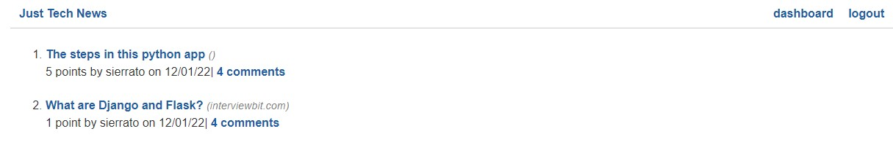
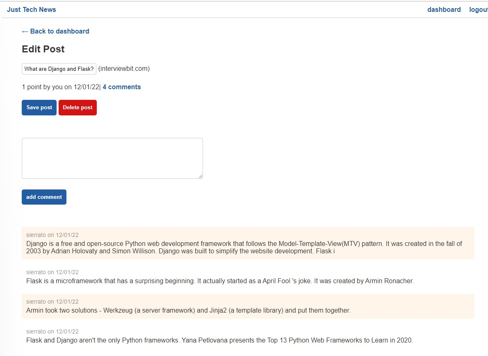

## Python Newsfeed

## Description

Python Newsfeed is a social media application built as an implementation of a Python API. Users can create an account or login, create/edit/delete a post, and comment on/like the posts of other users. The API was built using Python, MySQL, PyMySQL, SQLAlchemy (ORM), bycrpt (password hashing), Flask and gunicorn. It was implemented into frontend using Jinja2 for templating.

This Just Tech News application is refactored to use Python instead of Javascript on the backend.

## Table of Contents

- [Technologies Used](#technologies-used)
- [Deployment](#deployment)
- [Usage](#usage)
- [References](#references)
- [License](#license)

## Technologies Used

- Python
- Flask
- MySQL
- PyMySQL
- SQLAlchemy (ORM)
- Gunicorn
- Jinja
- bycrpt
- python-dotenv

## Deployment

- The application has been deployed to Heroku:-

  

- The URL of the functional deployed application is https://serene-sierra-38154.herokuapp.com/

## Usage

This application requires the following steps up to deployment:-

- Setting up a virtual environment for Python by using the venv module
- Defining the functions and classes by using the Python syntax
- Creating and importing the Python packages and modules
- Using the Flask library to create GET, POST, PUT, and DELETE routes
- Creating MySQL tables by using the SQLAlchemy ORM
- Querying a database by using SQLAlchemy methods.
- Handling errors by using assert and try ....except statements
- Using the contextual g and session objects of Flask across routes
- Importing custom filter functions into Jinja templates.
- Creating the custom decrator functions.
- Saving the project dependencies in a requirements.txt file.
- Installing the Gunicorn Library
- Configuring Heroku by using Gunicorn to run flask

At develop stage, the flask server is start by running the following command, python -m flask run

The screenshots of the overview of the application:-

- **The login and signup page**
  

- **The dashboard page**
  

- **The create new posts page**
  

- **The comments page**
  

- **The Edits page**  
  

## References

- Python for Javascript Developers (Continuation Course)

## License

This project is licensed under the MIT license.
